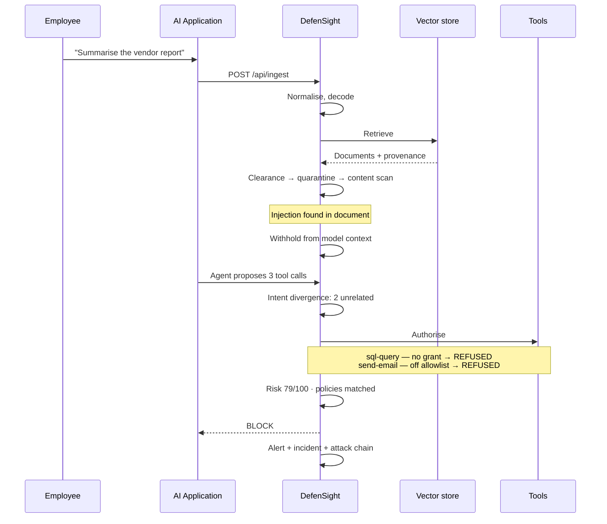

# Architecture

**Deliverable §28.3** — major components, data flows and trust boundaries.

## The shape of the problem

Traditional controls sit at the network and storage layers. Neither can see
what a model was *instructed* to do, which document did the instructing, what
the agent decided as a result, or whether the tool it invoked was one it was
ever permitted to touch. DefenSight is a control plane that sits inside that
gap.

## Trust boundaries

Four boundaries matter. Content crossing any of them is untrusted until proven
otherwise, and **trust never increases by crossing inward**.

```mermaid
flowchart TB
    subgraph EXTERNAL["🔴 UNTRUSTED — outside the organisation"]
        WEB["Public web content"]
        VENDOR["Vendor portal uploads"]
        CUST["Customer-authored text"]
    end

    subgraph INTERNAL["🟡 SEMI-TRUSTED — internal, unreviewed"]
        WIKI["Wikis, runbooks"]
        UPLOAD["Employee uploads"]
    end

    subgraph REVIEWED["🟢 TRUSTED — reviewed at source"]
        POLICY["Policies, standards"]
        FINANCE["Generated reports"]
        LEGAL["Contract vault"]
    end

    subgraph DEFENSIGHT["DEFENSIGHT CONTROL PLANE"]
        PIPE["Defensive pipeline"]
    end

    subgraph ESTATE["AI ESTATE"]
        APPS["Applications"]
        AGENTS["Agents"]
        MODELS["LLMs"]
    end

    subgraph ACTIONS["🔴 ACTION SURFACE — effects leave the boundary"]
        DB[("Warehouse")]
        API["Business APIs"]
        EMAIL["Outbound email"]
        DEPLOY["Deployments"]
    end

    EXTERNAL --> PIPE
    INTERNAL --> PIPE
    REVIEWED --> PIPE
    PIPE --> ESTATE
    ESTATE --> PIPE
    PIPE --> ACTIONS

    style EXTERNAL fill:#3d0d15,stroke:#ff3b52
    style INTERNAL fill:#38290a,stroke:#ffc53d
    style REVIEWED fill:#0a2e18,stroke:#22c55e
    style DEFENSIGHT fill:#0e4f5f,stroke:#22d3ee
    style ACTIONS fill:#3d0d15,stroke:#ff3b52
```

The load-bearing rule: **a document's trust ceiling is set by its provenance
and can only fall.** Content cannot earn credibility its origin does not
justify, which is what prevents hostile material being laundered by looking
official.

## Component map

```mermaid
flowchart LR
    subgraph CONSOLE["Console — Next.js App Router"]
        UI["19 routes"]
        SSE["SSE client"]
    end

    subgraph API["API layer"]
        INGEST["/api/ingest"]
        STREAM["/api/stream"]
        ADMIN["Config + approvals"]
    end

    subgraph RUNTIME["Runtime — src/lib/runtime"]
        CTX["Context builder"]
        PERSIST["Persistence"]
        BUS["Event bus"]
    end

    subgraph ENGINE["Engine — src/lib/engine (pure)"]
        NORM["Normalisation"]
        DETECT["5 detection layers"]
        FUSE["Fusion"]
        RISK["Risk engine"]
        POLICY["Policy engine"]
        GUARD["Guardrails"]
        TOOLGW["Tool gateway"]
        BEHAV["Agent behaviour"]
    end

    DB[("SQLite / Prisma")]

    UI --> API
    SSE -.-> STREAM
    INGEST --> CTX --> ENGINE
    ENGINE --> PERSIST --> DB
    PERSIST --> BUS --> STREAM
    CTX --> DB
    ADMIN --> DB

    NORM --> DETECT --> FUSE --> RISK --> POLICY
    GUARD --> POLICY
    TOOLGW --> POLICY
    BEHAV --> RISK

    style ENGINE fill:#0e4f5f,stroke:#22d3ee
```

**The engine is pure.** No database, no framework, no I/O. It receives a fully
materialised `AnalysisContext` and returns an `AnalysisResult`. Three
consequences follow:

1. Security logic is unit-testable in isolation — the attack matrix runs the
   real engine, not a mock of it.
2. Live traffic, the attack simulator and historical replay share one code
   path, so simulator results are real results.
3. A decision cannot depend on I/O ordering, so it is reproducible.

## The pipeline

Thirteen stages. Every one appends to a trace that becomes the attack chain an
analyst investigates.

```mermaid
flowchart TB
    A["1 Ingest<br/><i>normalise, decode</i>"] --> B["2 Input guardrails"]
    B --> C["3 RAG retrieval"]
    C --> D["4 Document scan<br/><i>clearance → quarantine → content</i>"]
    D --> E["5 Threat detection<br/><i>5 layers, fused</i>"]
    E --> F["6 Agent behaviour<br/><i>intent vs action</i>"]
    F --> G["7 Tool authorisation<br/><i>13 checks, default closed</i>"]
    G --> H["8 Output analysis"]
    H --> I["9 Risk scoring<br/><i>12 explainable factors</i>"]
    I --> J["10 Policy evaluation"]
    J --> K["11 Decision<br/><i>most restrictive wins</i>"]
    K --> L["12 Response / redaction"]
    L --> M["13 Alert + incident"]

    style E fill:#0e4f5f,stroke:#22d3ee
    style I fill:#0e4f5f,stroke:#22d3ee
    style K fill:#3d0d15,stroke:#ff3b52
```

Two properties are load-bearing and both are under test:

**Order independence.** Stages contribute findings; they never decide. The
verdict is the most restrictive outcome across guardrails, policies and the
tool gateway, computed once at the end. Reversing policy order provably cannot
change the result.

**Retrieved content is never instructions.** Text arriving from a document or
tool result is judged on a stricter footing than text the user typed, and
directives found there are withheld rather than obeyed.

Ordering detail worth noting: output analysis runs at stage 8, *before*
scoring. It originally ran last, which meant a response carrying credentials
was blocked by the output guardrail but recorded zero risk and no threat type —
benign in every view except the one that stopped it.

## Detection: five layers, fused not stacked

| Layer | Method | Ceiling alone |
|---|---|---|
| Lexical | 10 weighted behaviour families, diminishing returns | 0.97 |
| Structural | Imperative density, isolated command blocks, register contrast | 0.72 |
| Semantic | Character n-gram cosine vs attack corpus, scored on margin over a benign baseline | 0.78 |
| Behavioural | Welford baselines, z-score per subject | 0.68 |
| Authorization | Grants, clearances, quarantine state | 1.00 |

Fusion is noisy-OR across **layers**, not detections — two lexical hits on one
phrase are one observation seen twice. Each layer carries a reliability weight,
and independent agreement earns an explicit bonus.

Confidence is capped by the number of *independent behaviours* observed: one
indicator is a lead, three are a verdict.

## Data flow for one request

## Storage

SQLite via Prisma 7 with the better-sqlite3 driver adapter, so the platform
runs with no infrastructure. Twenty-four models covering identity, the AI
estate, the knowledge base, the tool gateway, events, detections, controls,
incidents, alerts, audit and behavioural baselines.

Enums are declared in the schema rather than as loose strings, so a threat type
cannot drift between the engine that detects it and the row that records it.
The schema is Postgres-compatible: only the connection string changes.

## Realtime

Server-Sent Events, not WebSockets — traffic is strictly one-way, SSE
reconnects on its own, and it survives proxies that mangle upgrades. The stream
carries a replay buffer so a console opened mid-stream is not staring at an
empty table, and a heartbeat so idle connections are not silently dropped.
Connection state is surfaced in the UI: a monitor that has quietly stopped
receiving data while still looking healthy is worse than one that visibly
reconnects.

## AI automation boundary

```mermaid
flowchart LR
    subgraph DET["DETERMINISTIC — enforcement"]
        A["Detection"] --> B["Risk scoring"] --> C["Policy"] --> D["Decision"]
    end
    subgraph AI["ADVISORY — explanation"]
        E["Classification"]
        F["Explanation"]
        G["Summaries"]
        H["Mitigations"]
    end
    D --> AI
    style DET fill:#0a2e18,stroke:#22c55e
    style AI fill:#0e4f5f,stroke:#22d3ee
```

The arrow points one way. AI automation reads the recorded result and never
participates in producing it. Every capability has a deterministic fallback, so
a missing key or a rate limit degrades the prose and never the security.

Event correlation is deliberately *not* asked of a model: whether two events
are related is a factual question, and a hallucinated link during an
investigation is worse than no link.
