# Threat Model

**Deliverable §28.4** — major threats against the AI ecosystem.

Scoped to the Northwind Group estate: six AI applications, twelve agents,
seventeen tools, three vector stores and seven data sources, five of which are
internal and two externally fed.

## What is actually different about AI systems

Classical application security assumes a boundary between code and data. An AI
application dissolves it: the model's instructions and the content it processes
arrive as the same token stream. Everything below follows from that.

Three consequences shape the whole model:

1. **Any content the model reads is potential instruction.** A document, a
   search result, a support ticket, a tool response.
2. **The agent's permissions are the real blast radius.** An attacker who
   controls an agent's *goal* still cannot exceed its *grants* — which makes
   least privilege load-bearing rather than hygiene.
3. **Output is an exfiltration channel.** Anything the model can say, it can
   say to the wrong person.

## Assets

| Asset | Why it matters | Where it lives |
|---|---|---|
| Customer PII and payment data | Regulatory and contractual exposure | Warehouse, CRM, feedback pipeline |
| Employee records and compensation | Privacy, internal trust | HRIS, HR vault |
| Confidential business material | Competitive and financial harm | Finance bucket, board packs |
| Contracts and legal material | Privilege, negotiating position | Contract vault |
| Credentials and API keys | Pivot to every other asset | Config, occasionally leaked into documents |
| System prompts and tool schemas | Reconnaissance for further attack | Application configuration |
| Action capability | Payments, deployments, outbound mail | The tool catalogue |

## Attackers

| Actor | Capability | Motivation |
|---|---|---|
| External via supply chain | Uploads to the vendor portal, controls linked web content | Data theft, fraud |
| Malicious insider | Authenticated, knows the estate | Exfiltration, privilege escalation |
| Curious insider | Authenticated, probing | Access beyond clearance |
| Compromised account | Full user privileges | Whatever the account permits |
| Automated crawler | Plants content, no interaction | Opportunistic |

The primary actor is the first. **The vendor portal is the sharpest edge in the
estate**: externally authored, unreviewed, indexed for retrieval, trusted at
22/100. An attacker needs no credentials — only a document an employee will
ask about.

## Threat catalogue

Twenty-three threat types across seven families, mapped to OWASP Top 10 for LLM
Applications and MITRE ATLAS.

### Injection and jailbreak

| Threat | Vector | Impact | OWASP | ATLAS | Control |
|---|---|---|---|---|---|
| Prompt injection | User text overrides system prompt | Model redirected | LLM01 | AML.T0051 | Five-layer detection, input guardrail |
| **Indirect prompt injection** | Instructions inside retrieved content | Agent acts for the attacker | LLM01 | AML.T0051.001 | Lower threshold on retrieved content; withheld, never obeyed |
| Jailbreak | Persona framing, hypotheticals | Safety bypassed | LLM01 | AML.T0054 | Lexical + semantic; blocked at 65% |
| Instruction override | "Ignore all previous instructions" | Configuration voided | LLM01 | — | Pattern family, highest weight |
| Role manipulation | Fabricated authority | Privilege claimed | LLM01 | — | Pattern family + divergence |
| System prompt extraction | Requests for configuration | Reconnaissance | LLM07 | AML.T0056 | Input block + output leak comparison |
| Encoded payload | Base64, hex, ROT13, homoglyph, zero-width | Detection bypassed | LLM01 | — | Recursive decode to depth 3, re-scan each form |

**Indirect prompt injection is the highest-priority threat in this estate.**
It requires no credentials, arrives through a normal business process, and its
payload executes with the agent's authority rather than the attacker's.

### RAG and knowledge base

| Threat | Vector | Impact | OWASP | Control |
|---|---|---|---|---|
| RAG poisoning | Adversarial content indexed | Retrieval delivers the attack | LLM08 | Scan at ingestion, quarantine before indexing |
| Malicious document | Hidden instructions, concealed text | Model manipulated | LLM08 | Five detection layers on document content |
| Unauthorized document access | Similarity ignores clearance | Disclosure beyond entitlement | LLM08 | Clearance checked *before* content analysis |

Vector similarity is not an access control. Two documents can be semantically
adjacent and legally worlds apart, so clearance is enforced at retrieval as a
separate gate.

### Data

| Threat | Vector | Impact | OWASP | ATLAS | Control |
|---|---|---|---|---|---|
| Data leakage | Sensitive values in a response | Disclosure | LLM02 | — | Output guardrails, redaction |
| Data exfiltration | Outbound URL, email, webhook | Loss beyond the boundary | LLM02 | AML.T0057 | Egress allowlist, marker detection |
| Secret exposure | Credentials in prompt, document or output | Pivot to other systems | LLM02 | — | Entropy-validated detection, zero tolerance |

### Tool and agent

| Threat | Vector | Impact | OWASP | ATLAS | Control |
|---|---|---|---|---|---|
| Unauthorized tool call | Agent invokes an ungranted tool | Action beyond authority | LLM06 | — | Default-closed gateway |
| Tool abuse | Destructive or injected parameters | Data loss | LLM06 | AML.T0053 | Schema validation, destructive-SQL detection |
| Excessive permissions | Over-broad grants | Wider blast radius | LLM06 | — | Least-privilege findings surfaced |
| Abnormal tool usage | Rate or sequence deviation | Automated abuse | LLM06 | — | Per-subject baselines |
| **Agent goal divergence** | Agent acts outside user intent | Successful injection | LLM06 | — | Intent-versus-action comparison |

Goal divergence is the **observable signature of a successful injection**. An
attacker can change what the agent wants; they cannot retroactively change what
the user asked for.

### Access and output

| Threat | Vector | Impact | Control |
|---|---|---|---|
| Unauthorized access | Reaching data beyond clearance | Disclosure | Clearance enforcement |
| Suspicious user behaviour | Probing, repeated failures | Reconnaissance | Behavioural baselines |
| Unsafe output | Harmful content | Compliance | Output content filter |

## The demonstration attack, decomposed

The §27 scenario, and why each stage fails for the attacker:

```mermaid
flowchart TB
    A["Attacker uploads a plausible<br/>vendor report to the portal"] --> B["Document indexed<br/>trust 22/100"]
    B --> C["Employee: 'summarise the<br/>Q3 vendor report'"]
    C --> D["RAG retrieves it"]
    D --> E{"Content scan"}
    E -->|"3 layers agree<br/>97% confidence"| F["Withheld from<br/>model context"]
    D --> G["Injected directive:<br/>query customers, email out"]
    G --> H{"Tool gateway"}
    H -->|"sql-query:<br/>no grant"| I["REFUSED"]
    H -->|"send-email:<br/>off allowlist"| J["REFUSED"]
    G --> K{"Divergence"}
    K -->|"summarise ≠ email"| L["Flagged"]
    F --> M["Risk 79/100 → BLOCK"]
    I --> M
    J --> M
    L --> M
    M --> N["Incident + attack chain"]

    style E fill:#0e4f5f,stroke:#22d3ee
    style H fill:#0e4f5f,stroke:#22d3ee
    style M fill:#3d0d15,stroke:#ff3b52
```

**Four independent controls each stop this attack alone.** Content detection,
retrieval withholding, tool authorisation and egress control are not layered
for redundancy theatre — each addresses a different assumption, so defeating one
does not advance the attacker.

## Residual risk

Stated plainly, because a threat model that claims complete coverage is not one.

| Risk | Assessment | Mitigation |
|---|---|---|
| **Novel injection phrasing** | A technique unlike anything in the corpus may evade the lexical and semantic layers | Structural analysis is vocabulary-independent; tool authorisation and egress control are unaffected by phrasing entirely |
| **Detection threshold tuning** | Thresholds are calibrated against a finite corpus; a determined attacker could probe for the boundary | Behavioural layer detects probing itself; every blocked attempt raises the principal's risk |
| **Insider with legitimate access** | An authorised user retrieving data they are cleared for is not an attack the platform can distinguish | Audit trail, behavioural baselines, analytics on user risk |
| **Model-layer attacks** | Weight poisoning and training-data attacks are outside this platform's boundary | Model provenance is a procurement control, not a runtime one |
| **Approval fatigue** | An analyst rubber-stamping approvals defeats the human gate | Approval cards carry the originating user request alongside the arguments |
| **Compromised DefenSight** | The control plane is itself a target | Append-only audit, RBAC, no self-modifying automation |

## Design decisions and their trade-offs

| Decision | Rationale | Cost accepted |
|---|---|---|
| Default-closed tool gateway | Absence of a grant is a denial | Legitimate new capability needs an explicit grant |
| Trust can only fall | Prevents laundering hostile content | A genuinely good document from a poor source stays low-trust |
| Lower threshold on retrieved content | The user never consented to it | More analyst review on document-heavy traffic |
| Confidence capped until layers agree | One detector is a lead, not a verdict | A genuine single-layer detection is under-weighted |
| AI advisory only | Enforcement must be reproducible | No model-driven detection of genuinely novel attacks |
| Correlation computed, not inferred | A hallucinated link misleads an investigation | Only explicit relationships are found |
